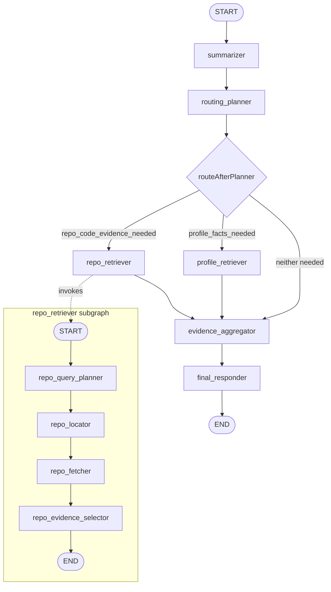

# Ronak - Ask Me Anything

A fact-grounded personal AMA chat app for Ronak Vimal. Visitors can ask normal general questions, personal questions about Ronak, or code/repository questions about allowlisted GitHub repositories. The frontend is a React single-page chat UI; the backend is a Cloudflare Pages Function that runs a LangGraph workflow over Groq's OpenAI-compatible API.

Live URL: `https://ama-ronak.pages.dev/`

## Project Summary

The app is designed around one rule: personal and code-specific claims should come from retrieved evidence, not from model memory.

- Personal facts come from `data/profile.json`.
- Repository/code facts come from allowlisted GitHub repositories through server-side GitHub REST API calls.
- General questions can be answered directly by the model.
- The final responder never calls tools directly. It only sees the planner decision, retrieved evidence, conversation context, and the latest user message.

The backend uses LangGraph memory with a browser-generated `threadId`. Conversation state is stateful inside one browser thread and resets when the browser session creates a new thread.

## Tech Stack

- React 19 + TypeScript
- Vite 6
- Cloudflare Pages Functions
- LangGraph JS
- Groq API using `openai/gpt-oss-120b`
- GitHub REST API for server-side repository evidence
- React Markdown + `remark-gfm`
- Lucide React
- Tailwind via CDN plus custom CSS in `index.html`

## Repository Layout

- `App.tsx`: React chat UI, thread id handling, debug query flag.
- `services/groqService.ts`: Browser-to-backend `/api/chat` client.
- `functions/api/chat.ts`: Cloudflare Pages Function, LangGraph workflow, Groq calls, profile retrieval, GitHub retrieval.
- `data/profile.json`: Authoritative personal profile data.
- `README.md`: Project and architecture documentation.

## Runtime Request Shape

The browser sends:

```json
{
  "history": [{ "role": "user", "content": "..." }],
  "newMessage": "...",
  "threadId": "...",
  "debug": false
}
```

`debug` is optional. When true, backend logs planner output, retrieval decisions, selected keys, selected repo files, evidence counts, retry events, and final evidence mode. Secrets are not logged.

## Complete Graph



When the planner returns both `profile_facts_needed.needed = true` and `repo_code_evidence_needed.needed = true`, LangGraph fans out to both retriever nodes before joining at `evidence_aggregator`.

## Main Graph State

`ChatGraphState` is persisted by `MemorySaver` using the request `threadId`.

| State key | Type | Purpose | Updated by |
| --- | --- | --- | --- |
| `history` | `HistoryMessage[]` | Stateful server-side user/assistant history for the thread. Uses append reducer. | `final_responder` |
| `clientHistory` | `HistoryMessage[]` | Browser-provided history fallback. Uses replace reducer. | initial graph input |
| `newMessage` | `string` | Latest user message for this turn. | initial graph input |
| `recentHistory` | `HistoryMessage[]` | Last `MAX_HISTORY_LENGTH` messages. Currently `6`. | `routing_planner` |
| `summary` | `string` | Rolling summary of older messages for reference resolution only. Not authoritative evidence. | `summarizer` |
| `summarizedMessageCount` | `number` | Count of thread messages already folded into summary. | `summarizer` |
| `routingPlan` | `PlannerOutput` | Structured decision: whether profile and/or repo evidence is needed. | `routing_planner` |
| `profileEvidence` | `ProfileEvidence` | Retrieved profile facts, missing keys, invalid keys, sufficiency. | `routing_planner`, `profile_retriever` |
| `repoEvidence` | `RepoEvidence` | Retrieved repo chunks, selected repos, refs, files, PRs, sufficiency. | `routing_planner`, `repo_retriever` |
| `evidenceMode` | `profile_only`, `repo_only`, `both`, `neither` | Final prompt variant selected from available evidence. | `routing_planner`, `evidence_aggregator` |
| `responseText` | `string` | Final assistant response returned to the browser. | `final_responder` |

`routing_planner` resets `profileEvidence`, `repoEvidence`, and `evidenceMode` at the start of every turn. This prevents stale evidence from a previous message from leaking into a later answer.

## Repo Subgraph State

`RepoGraphState` is scoped to one repository retrieval invocation.

| State key | Type | Purpose | Updated by |
| --- | --- | --- | --- |
| `newMessage` | `string` | Latest user message. | subgraph input |
| `summary` | `string` | Thread summary for follow-up reference resolution. | subgraph input |
| `recentHistory` | `HistoryMessage[]` | Recent context for follow-up questions. | subgraph input |
| `routingPlan` | `PlannerOutput` | Main planner output. | subgraph input |
| `repoPlan` | `RepoRetrievalPlan` | Structured repo retrieval plan with target repos, ref, PRs, file hints, search terms. | `repo_query_planner` |
| `locatedTargets` | `RepoTarget[]` | Allowlist-approved repos and refs to fetch. | `repo_locator` |
| `fetchedFiles` | `RepoFetchedFile[]` | Bounded file contents fetched from GitHub. | `repo_fetcher` |
| `fetchedPulls` | `RepoFetchedPull[]` | Bounded PR metadata and changed-file patches. | `repo_fetcher` |
| `evidence` | `RepoEvidence` | Final structured repo evidence chunks and sufficiency. | `repo_locator`, `repo_fetcher`, `repo_evidence_selector` |

## Node Behavior

### `summarizer`

Purpose:

- Keeps long threads manageable.
- Summarizes older messages once thread history exceeds `MAX_HISTORY_LENGTH`.
- Preserves follow-up context, unresolved topics, and user instructions.

State updates:

- `summary`
- `summarizedMessageCount`

Important constraint:

- The summary is context only. It is never treated as authoritative profile or repo evidence.

### `routing_planner`

Purpose:

- Replaces the older binary personal/general classifier.
- Uses strict JSON schema output to decide whether this turn needs profile facts, repo/code evidence, both, or neither.

Planner output shape:

```json
{
  "profile_facts_needed": {
    "needed": true,
    "reason": "The user asks about Ronak's education.",
    "query": "Ronak's education"
  },
  "repo_code_evidence_needed": {
    "needed": false,
    "reason": "",
    "query": ""
  }
}
```

State updates:

- `recentHistory`
- `routingPlan`
- resets `profileEvidence`
- resets `repoEvidence`
- resets `evidenceMode`

Fallback:

- If planner JSON parsing fails locally, a conservative keyword-based inference is used.

### `profile_retriever`

Purpose:

- Runs only when `routingPlan.profile_facts_needed.needed` is true.
- Selects relevant keys from `PROFILE_KEY_PATHS`.
- Reads values deterministically from `data/profile.json`.

Profile evidence shape:

```json
{
  "status": "ok",
  "requested_key_paths": ["projects", "technical_skills"],
  "resolved_facts": {
    "projects": {},
    "technical_skills": {}
  },
  "missing_key_paths": [],
  "invalid_key_paths": [],
  "sufficient": true,
  "reason": "Profile facts resolved.",
  "attempts": 1
}
```

State updates:

- `profileEvidence`

Bounds and fallback:

- Maximum profile key-selection passes: `MAX_PROFILE_SELECTION_ATTEMPTS = 2`.
- Invalid keys are rejected by the backend.
- Missing or empty profile values make evidence insufficient.
- If Groq fails structured JSON generation for key selection, the backend falls back to deterministic keyword-based key selection.

### `repo_retriever`

Purpose:

- Runs only when `routingPlan.repo_code_evidence_needed.needed` is true.
- Invokes the bounded repo retrieval subgraph.
- Enforces server-side GitHub setup and safe fallback if GitHub is not configured.

State updates:

- `repoEvidence`

Safe failure behavior:

- If `GITHUB_TOKEN` or `GITHUB_REPO_ALLOWLIST` is missing, repo evidence becomes insufficient.
- GitHub API errors are logged in debug mode without exposing secrets to the browser.

### `evidence_aggregator`

Purpose:

- Chooses the final responder prompt variant based on what evidence is sufficient.

Evidence mode rules:

| Profile evidence sufficient | Repo evidence sufficient | `evidenceMode` |
| --- | --- | --- |
| true | true | `both` |
| true | false | `profile_only` |
| false | true | `repo_only` |
| false | false | `neither` |

State updates:

- `evidenceMode`

### `final_responder`

Purpose:

- Generates the final assistant response.
- Does not call profile or GitHub tools directly.
- Answers using only the evidence provided by retrievers plus normal conversation context.

State updates:

- `responseText`
- appends current user message and assistant response to `history`

Prompt variants:

- `profile_only`: use only profile evidence for personal facts.
- `repo_only`: use only repo evidence for code/repo facts.
- `both`: use profile evidence for personal facts and repo evidence for code facts.
- `neither`: answer normal general questions; do not claim profile or repo-specific facts.

Direct fallback behavior:

- If only profile evidence was needed but is insufficient, returns the missing-info response.
- If only repo evidence was needed but is insufficient, returns a repository-insufficient response.

## Repo Retriever Subgraph

### `repo_query_planner`

Purpose:

- Converts the user's repo/code question into a retrieval plan.
- Extracts target repos, branch/ref, PR numbers, file hints, search terms, and a self-contained code question.

State updates:

- `repoPlan`

Backend heuristics also add useful file hints:

- Dependency/package questions add `package.json`.
- Chat/routing/LangGraph/backend questions add `functions/api/chat.ts`.
- Frontend/UI/app questions add `App.tsx`.
- README/project questions add `README.md`.

### `repo_locator`

Purpose:

- Enforces `GITHUB_REPO_ALLOWLIST`.
- Chooses which repos and refs can be queried.

Rules:

- If the user names a repo, it must be in the allowlist.
- If no repo is named, the backend uses the first allowlisted repos up to `MAX_ALLOWED_REPOS_TO_SCAN = 3`.
- Ref selection uses the user-provided ref, then `GITHUB_DEFAULT_REFS[repo]`, then `main`.

State updates:

- `locatedTargets`
- can set insufficient `evidence` if a requested repo is not allowlisted

### `repo_fetcher`

Purpose:

- Fetches bounded GitHub data.

GitHub REST data fetched:

- Recursive repository tree for selected repo/ref.
- File contents for selected candidate files.
- PR metadata and changed files when PR numbers are requested.

Bounds:

- `MAX_REPO_RETRIEVAL_ROUNDS = 2`
- `MAX_REPO_FILES = 5`
- `MAX_REPO_FILE_BYTES = 20 * 1024`
- binary asset extensions are skipped

State updates:

- `fetchedFiles`
- `fetchedPulls`
- partial `evidence` metadata such as selected repos, refs, PR numbers, file paths, and rounds

Current limitation:

- Repository metadata such as stars, forks, primary language, repository description, and recent commits are not fetched yet. Overview questions that ask for those fields may be marked insufficient unless README/file evidence is enough.

### `repo_evidence_selector`

Purpose:

- Compresses fetched GitHub data into small structured evidence chunks for the final responder.

Bounds:

- `MAX_REPO_SELECTOR_CONTEXT_CHARS = 6000`
- `MAX_REPO_SELECTOR_FILE_CHARS = 1400`
- `MAX_REPO_SELECTOR_PR_BODY_CHARS = 600`
- `MAX_REPO_SELECTOR_PR_PATCH_CHARS = 800`
- `MAX_REPO_EVIDENCE_CHUNKS = 8`

Evidence chunk shape:

```json
{
  "source_type": "file",
  "repo": "Kytamnh/Ask-Me-Anything",
  "ref": "langgraph",
  "path": "functions/api/chat.ts",
  "pr_number": 0,
  "title": "LangGraph workflow",
  "summary": "The backend uses a planner and conditional retrieval before final response.",
  "quote": "addConditionalEdges(\"routing_planner\", routeAfterPlanner",
  "confidence": "high"
}
```

State updates:

- final `evidence`

## Evidence Boundaries

Profile evidence rules:

- Personal facts must come from `data/profile.json`.
- Chat history and summary can resolve references, but they are not evidence.
- The model should not invent missing profile facts.

Repo evidence rules:

- Code/repository claims must come from fetched GitHub evidence.
- Only repos in `GITHUB_REPO_ALLOWLIST` are accessible.
- GitHub token is server-side only.
- Raw fetched files are compressed into evidence chunks before final response.

General answer rules:

- General questions can be answered normally.
- General answers should not claim Ronak-specific profile facts or repo-specific implementation facts unless evidence exists.

## Retry And Fallback Logic

### Groq API key rotation

The backend supports up to five Groq keys:

- `GROQ_API_KEY_1`
- `GROQ_API_KEY_2`
- `GROQ_API_KEY_3`
- `GROQ_API_KEY_4`
- `GROQ_API_KEY_5`

The selected key index is stored in an HTTP-only session cookie named `groq_api_key_index`.

Behavior:

- Starts with key 1 unless the cookie says otherwise.
- On rate limit, moves to the next key.
- If all keys are rate limited, returns a rate-limit fallback response.

### Groq request retries

`MAX_LLM_ATTEMPTS = 3`, meaning one initial attempt plus two retries.

Retryable cases:

- transient Groq/API/network failures: `408`, `500`, `502`, `503`, `504`, fetch failures, network errors, timeouts
- structured JSON generation failure from Groq: `400 Failed to generate JSON` / `failed_generation`

Non-retryable cases:

- invalid API key
- most non-transient 400-level errors

### Profile key selection fallback

If profile key selection fails structured JSON generation after retries:

- backend uses deterministic keyword selection
- selected keys are still validated against `PROFILE_KEY_PATHS`
- values are still read only from `data/profile.json`

### Repo retrieval fallback

Repo retrieval returns insufficient evidence instead of exposing internal GitHub errors when:

- GitHub token is missing
- repo allowlist is missing
- requested repo is not allowlisted
- GitHub fetch fails
- fetched evidence is not enough for the requested answer

## Debug Logging

Enable debug mode by opening:

```text
http://localhost:8788/?debug=true
```

The frontend sends `debug: true` in the `/api/chat` request.

Debug logs can include:

- selected Groq API key index and attempt
- planner JSON
- selected profile keys and sufficiency
- repo plan, selected repos, refs, PR numbers, file paths
- repo selector context size
- repo evidence chunk count and sufficiency
- final evidence mode
- retry events

Debug logs do not print `GITHUB_TOKEN`.

## Environment Variables

Required for Groq:

```bash
GROQ_API_KEY_1=your_groq_key
GROQ_API_KEY_2=your_groq_key
GROQ_API_KEY_3=your_groq_key
GROQ_API_KEY_4=your_groq_key
GROQ_API_KEY_5=your_groq_key
```

Required for GitHub-aware repo answers:

```bash
GITHUB_TOKEN=your_fine_grained_github_pat
GITHUB_REPO_ALLOWLIST=Kytamnh/Ask-Me-Anything,owner/another-repo
GITHUB_DEFAULT_REFS={"Kytamnh/Ask-Me-Anything":"langgraph","owner/another-repo":"main"}
```

GitHub token permissions:

- Contents: read
- Pull requests: read
- repository access only for allowlisted repos

## Local Development

Prerequisites:

- Node.js 18 or newer
- npm
- Wrangler, invoked through `npx`

Install dependencies:

```bash
npm install
```

Create `.dev.vars` for Wrangler Pages Functions:

```bash
GROQ_API_KEY_1=your_groq_key
GROQ_API_KEY_2=your_groq_key
GROQ_API_KEY_3=your_groq_key
GROQ_API_KEY_4=your_groq_key
GROQ_API_KEY_5=your_groq_key
GITHUB_TOKEN=your_fine_grained_github_pat
GITHUB_REPO_ALLOWLIST=Kytamnh/Ask-Me-Anything
GITHUB_DEFAULT_REFS={"Kytamnh/Ask-Me-Anything":"langgraph"}
```

Run the frontend:

```bash
npm run dev
```

Run Pages Functions proxy in another terminal:

```bash
npx wrangler pages dev --proxy 3000
```

Open:

```text
http://localhost:8788
```

Debug mode:

```text
http://localhost:8788/?debug=true
```

## Build And Validation

Type-check:

```bash
npx tsc --noEmit
```

Build frontend:

```bash
npm run build
```

Build Pages Functions:

```bash
npx wrangler pages functions build functions --outdir /tmp/ronak-functions-build --compatibility-date=2026-04-20
```

Preview Vite build:

```bash
npm run preview
```

## Deploy To Cloudflare Pages

Cloudflare Pages settings:

- Build command: `npm run build`
- Build output directory: `dist`
- Functions directory: `functions`

Set production and preview environment variables:

- `GROQ_API_KEY_1`
- `GROQ_API_KEY_2`
- `GROQ_API_KEY_3`
- `GROQ_API_KEY_4`
- `GROQ_API_KEY_5`
- `GITHUB_TOKEN`
- `GITHUB_REPO_ALLOWLIST`
- `GITHUB_DEFAULT_REFS`

Manual deploy:

```bash
npm run build
npx wrangler pages deploy dist --project-name ama-ronak
```

## Security Notes

- The browser never sees Groq API keys.
- The browser never sees `GITHUB_TOKEN`.
- GitHub access is restricted by `GITHUB_REPO_ALLOWLIST`.
- The GitHub PAT should be fine-grained and read-only.
- `.env.local` and `.dev.vars` should not be committed.
- If a secret is pasted into chat, rotate it.

## Known Limitations

- Repo retrieval currently focuses on file contents and PR changed files.
- Repository metadata such as stars, forks, primary language, repo description, and recent commits is not fetched yet.
- Repo evidence selection can mark evidence insufficient even when one file is fetched, especially for broad repo-overview questions.
- `MemorySaver` stores state in the running Worker process memory, so it is not durable across Cloudflare isolate/process restarts.

  

  


